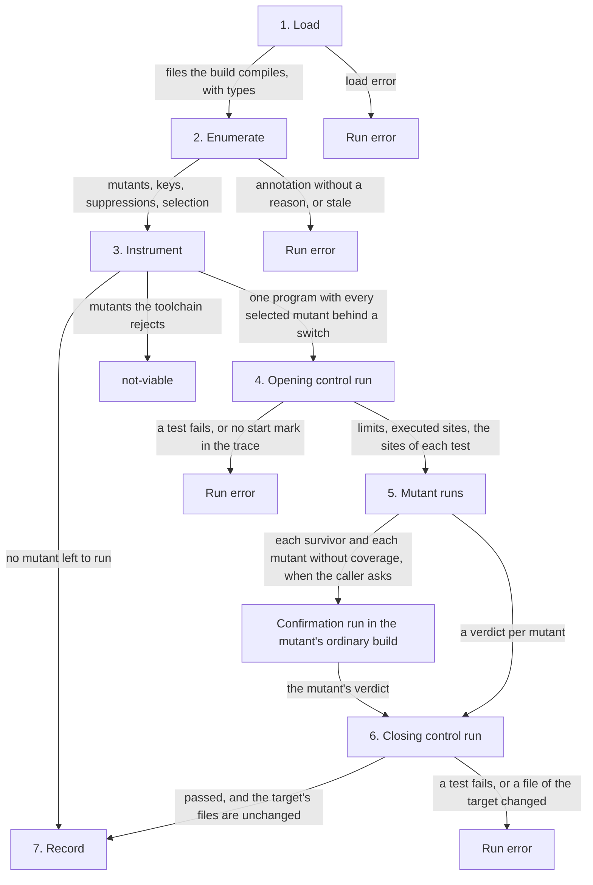

# RFC-0002: A mutation run and its record

## Summary

A mutation run in any language has seven steps in a fixed order. Each
mutant gets one of ten verdicts by fixed rules, one formula computes the
score, and the run writes one record for the platform. The mutants run
between two control runs with no mutant active. The first proves that the
instrumentation executes and sets the limits, and the second proves that no
mutant run changed what the tests depend on. On request, the engine runs
each survivor, and each mutant whose site the instrumented program never
executed, once more in that mutant's ordinary build, where a test of a
property of the build, such as an allocation count, can detect it. A shared
corpus of cases, with a fixture in each language, checks every engine
against all four.

## Motivation

The same outcome scores differently by tool:

- **PIT** counts a timeout, a memory error, a run error, a non-viable mutant
  and an equivalent mutant as detected.
- **StrykerJS's metrics** count a timeout as detected and leave runtime
  errors and compile errors out of the score.
- A mutant whose run errors raises PIT's score and leaves StrykerJS's
  unchanged.

Tools also misreport what happened:

- **kanly v0.1.0** counted as killed the mutants of 9 test binaries that the
  kernel ended for memory under a 4 GB limit. Under an 8 GB limit, one of
  its test binaries grew to 8.2 GB, and systemd stopped the whole run.
- **gremlins v0.6.0** reported all 318 mutants of google/btree as not
  covered and exited 0. btree's `go.mod` opens with a comment, and gremlins
  reads the module name from the first line.
- **ooze v0.2.0** built and tested 140 mutants in code that no build
  compiles, and reported each one as survived.

A run whose instrumentation never executes reports every mutant as a
survivor. On go-humanize, all 193 mutants of a prototype's first run
survived. The overlay that listed the instrumented files matched no file,
and the original package ran for every mutant.

The platform receives every engine's runs, so these rules cannot differ by
language.

## Detailed design

### Components

| Component | Responsibility |
|---|---|
| The protocol | The steps of a run, their order, and what stops a run |
| The limits | The deadline and the memory ceiling of each program's run |
| The verdicts | One verdict per mutant, decided by fixed rules |
| The score | One number per run, computed from the verdicts |
| The record | One JSON document per run and target |
| The corpus | Cases with a fixture per language, which every engine passes |

A target is the unit one build covers: a package in Go, a module in Python.
Each language's engine defines its unit. The suite is the target's own
tests, and the tests of the other targets that the caller names.

Each language's engine offers a command named `dokimi-mutate` and the
language, such as `dokimi-mutate-go`, so a person or a CI job finds the
engine of every language by one rule.

### The protocol



1. **Load.** The engine reads the files that the build compiles for the
   target platform, with their type information where the language has
   it. A file outside the build is never read as a target.
2. **Enumerate.** The engine applies the operator catalogue, the
   exclusions and the suppressions, computes each mutant's key, and marks
   the mutants outside the run's selection. An annotation without a reason,
   or one that does not suppress any mutant, stops the run.
3. **Instrument.** The engine builds one program in which every selected
   mutant waits behind a runtime switch, or prepares the language's
   equivalent, such as rewriting loaded bytecode. A mutant that the
   toolchain rejects, alone or in the build, is `not-viable`. When every
   mutant is `not-selected`, `suppressed` or `not-viable`, or the target has
   none, the engine skips steps 4 to 6, because no verdict depends on the
   suite.
4. **Opening control run.** The engine first records a digest of each of
   the target's files. It then runs the suite once with no mutant active
   and a trace on. The trace records a start mark when the instrumented
   program starts, and each site the first time it executes.
   - Every test must pass. A failure stops the run, because no verdict
     means anything against a failing suite.
   - The trace must contain the start mark. Without it the program that ran
     is not the instrumented one, and the run stops.
   - The run sets the limits, and the trace sets which mutants have
     coverage.
   - When the caller asks for confirmation, the engine then builds the
     suite from the target's unchanged code, as the toolchain builds it
     without the engine, and runs it once. This is the ordinary control
     run. Every test must pass, or the run stops.
   - The engine then runs each test of a program alone, with no mutant
     active and a trace on, and records the sites that each test executes
     and the wall time of its run.
     A test is a test that the language's runner can run on its own, such
     as a top-level test function in Go. The engine does this only for a
     program that has more than one test and fewer tests than the run has
     mutants whose sites the program executed, because each test costs a
     run. A program has no such record when one of its tests fails alone,
     when a trace has no start mark, or when the caller's deadline leaves
     too little time for the mutant runs. Each mutant's `coveredBy` in the
     record lists the tests whose run alone executed the mutant's site. A
     developer who resolves a survivor finds there the tests that should
     have failed.
5. **Mutant runs.** The engine runs the suite once for each selected,
   viable mutant whose site executed, with that mutant alone active, and
   starts the runs in the order of the mutants' keys. The run stops at the
   first failing test. A mutant whose site never executed gets
   `no-coverage` and is not run.
   - In a program with a record of each test's sites, a mutant's run first
     runs the tests that executed the mutant's site, so that a kill does
     not wait for the tests that run before them. When they pass, the run
     goes on with the program's whole suite, so a mutant that they do not
     detect gets the verdict of the whole suite.
   - When the caller asks for confirmation, a mutant that survives its run
     or whose site never executed is confirmed before its verdict is
     final. The engine writes that mutant alone into the target's source,
     in the form that the language's overlay states for its kind, builds
     the suite from it, and runs the suite once more. The verdict of that
     run is the mutant's verdict, and a build that the toolchain rejects
     makes the mutant `not-viable`. A mutant whose site never executed
     keeps `no-coverage` when the run passes, because the ordinary build
     has no trace that shows whether the site executed.
   - The confirmation run applies the limits of a mutant's run. It runs the
     whole suite of each program that executed the mutant's site, and of
     every program for a mutant whose site never executed, in the order of
     a mutant's run.
6. **Closing control run.** The engine runs the suite once more with no
   mutant active. Every test must pass. A failure means that a mutant run
   changed something the tests depend on, such as a file outside their
   temporary directory, and the run ends with an error. The engine then
   compares the target's files with the digests of step 4, whether the
   closing control run passed or not. A file that a run added, changed or
   removed is the run error `changed-files`, whose message lists the files.
   The engine leaves the files as the runs left them, because a person can
   edit the target while the run lasts. A run whose closing control run does
   not complete, because the caller ended the run during it, fails: no run
   checked that the mutant runs left the tests' state intact.
7. **Record.** The engine writes the record.

The run upholds five invariants:

- **One mutant, once, alone.** Each selected, viable, covered mutant has
  one run in the instrumented program, with no other mutant active. A run
  that starts with the tests of the mutant's site runs the whole suite
  after them only when they pass. Under confirmation, a survivor and a
  mutant without coverage run once more, each alone in its ordinary build.
- **A run leaves the target's files unchanged.** A test that writes into
  the target's directory, such as a store of failing inputs that later runs
  replay, makes one mutant's verdict depend on another mutant's run. The
  digests of step 4 detect such a write, and the run's variable lets a test
  library skip its writes during a mutation run.
- **Load-time code runs under the mutant.** Each mutant runs in a fresh
  process, or the engine runs every mutant in code that executes while the
  program loads in a fresh process of its own. A Go package's
  initialization, a Python module's top level and a JVM class's static
  initializer are such code.
- **No run starts from another run's files.** Each run gets a temporary
  directory of its own, removed when the run ends, and the language's
  temporary directory setting points to it.
- **The verdicts do not depend on the order of the runs.** An engine runs
  one mutant of a target at a time unless the caller asks for more workers.
  Tests that share a resource outside their temporary directory, such as a
  fixed network port, give false kills when two copies run at once.

A key is the start of a SHA-256 digest, so the order of the keys is a
pseudo-random permutation of the mutants that every run of the same code
repeats. A run that the caller's deadline ends has then run a uniform
sample of the target's mutants, whatever their files.

The target's files are the files of its directory, hidden files included,
and of its subdirectories that no other target contains. Every file below
a subdirectory that the language's toolchain ignores, such as Go's
`testdata`, is one of them. Outside such a subdirectory, a directory whose
name starts with a dot, such as `.git`, is where a tool keeps its state,
and its files are not the target's.

### The run's variables

`spec/protocol.json` names two environment variables. Every run of the
suite has `DOKIMI_MUTATE_MUTANT`, and every run of the instrumented
program has `DOKIMI_MUTATE_INSTRUMENTED`:

| Run | `DOKIMI_MUTATE_MUTANT` | `DOKIMI_MUTATE_INSTRUMENTED` |
|---|---|---|
| The opening and the closing control run, and a run of one test alone | `0` | `1` |
| A mutant's run | A positive integer that identifies the mutant within the run | `1` |
| The ordinary control run | `0` | Not set |
| A confirmation run | The mutant's integer | Not set |

The engine removes `DOKIMI_MUTATE_INSTRUMENTED` from the environment of
the ordinary control run and of each confirmation run. A test or a test
library reads the variables in two cases:

- **State kept between runs.** A library that stores data for later runs,
  such as failing inputs that it replays first, does not store anything
  while `DOKIMI_MUTATE_MUTANT` is not `0`.
- **Properties of the build.** A test that asserts an allocation count or
  a duration skips while `DOKIMI_MUTATE_INSTRUMENTED` is set, in the
  control runs too. The instrumented program differs from the ordinary
  build in size and speed. In Go, a function with instrumented sites can
  exceed the inliner's budget, and a value that the ordinary build keeps on
  the stack then moves to the heap. A confirmation runs such a test against
  each survivor's ordinary build, where the test can detect the mutant.

### The suite

The suite contains the target's own tests, and the tests of every other
target of the same project that the caller names, such as a conformance
suite in another package that exercises the target:

- The engine builds the test program of each target that the caller names,
  with the target instrumented as in step 3, when the program's tests
  depend on the target. It leaves out a target whose tests do not, because
  those tests cannot execute the target's code.
- The opening control run traces each program on its own, and both control
  runs run every program. The record states the opening run's time as the
  sum of the programs' times, and its peak memory as the largest of their
  peaks. A mutant's site executed when any program's trace contains it.
- Each program has limits of its own, from its own time and peak in the
  opening control run.
- A mutant's run runs the programs whose trace contains the mutant's site:
  the target's own first, then the others in the order of their names. The
  first failing test ends the mutant's run. Each program's run ends at
  that program's deadline or memory ceiling, so a mutant that hangs in one
  program does not wait for the time of the others.
- The record's `suite` names the other targets, so a reader sees which
  tests a score measures. The inputs digest covers their tests and data.
- `tests` names a test of another target as the target's name, a colon, a
  space and the test's name, such as
  `example.com/codec/conformance: TestRoundTrip`.

Other targets count only when the caller names them, because each one adds
a build, and its tests run for every mutant whose site they execute.

### The limits

Each program of the suite has these limits, from its own run in the
opening control run, and they apply to each of its runs:

| Limit | Value | Why |
|---|---|---|
| Deadline | 10 × the program's wall time in the opening control run + 2 s | One measurement of the program's suite gives no variance estimate, so the margin is wide. The 2 s cover process start and scheduling |
| Memory ceiling | 4 × the program's peak resident memory in the opening control run + 512 MiB | A mutant that allocates without bound must end before it takes the machine |

The limits are fixed, so two runs of the same target apply the same ones.
A mutant's run of a program that starts with the tests of the mutant's site
ends that first part at 10 × the sum of those tests' wall times in their
runs alone + 2 s. A mutant that hangs in a fast test then does not wait for
the time of the program's slowest tests. Both parts together end at the
program's deadline. Where a
platform gives an engine no way to measure a process's resident memory, the
engine does not apply a ceiling, and each program's `memoryCeilingBytes` in
the record is `null`.

PIT's default deadline is 1.25 times a test's normal time plus 4 s, per
test. StrykerJS's is 1.5 times the net time plus 5 s plus the measured
overhead, per run.

### The verdicts

| Verdict | When | In the score |
|---|---|---|
| `killed` | The run failed on its own: a test failed, the program panicked or threw, or it exited with a failure status | Detected |
| `timed-out` | The run passed the deadline | Detected |
| `exhausted` | The run crossed the memory ceiling | Detected |
| `survived` | The run passed | Undetected |
| `no-coverage` | The opening control run never executed the mutant's site | Undetected |
| `not-viable` | The toolchain rejects the mutant | Excluded |
| `suppressed` | A rule family or an annotation suppresses it | Excluded |
| `not-selected` | It lies outside the run's selection | Excluded |
| `not-run` | The run ended before this mutant's verdict was final, because the caller's deadline passed, the caller cancelled, or the run had started the number of mutants that the caller allowed | Excluded |
| `error` | The run ended in a way the engine cannot classify, such as a signal that the engine did not send | Excluded |

A mutant that more than one excluded verdict fits gets the first that
applies of `not-selected`, `suppressed` and `not-viable`. A run restricted
to some lines then counts only the mutants on those lines. An annotation
still applies on every line, so an annotation that suppresses only mutants
outside the selection is not stale.

The score is detected over detected plus undetected:

```text
score = (killed + timed-out + exhausted)
      / (killed + timed-out + exhausted + survived + no-coverage)
```

This equals StrykerJS's mutation score on the verdicts that both define:

- A timeout counts as detected.
- An uncovered mutant counts as undetected.
- A compile error and an ignored mutant are excluded.

A run fails when it has a run error, when any mutant is `error`, when a
mutant is `not-run` for another reason than the caller's limit on the
number of mutant runs, or when its opening control run passed and its
closing control run did not complete. The score of a failed run is `null`.
The score is also `null` when the denominator is 0.

A run without a run error whose mutants did not all run, because the
caller's deadline passed, the caller ended the run, or the run had started
the number of mutants that the caller allowed, states a sample:

- The sample is the mutants that the score counts and whose keys sort
  before the first key of a `not-run` mutant.
- A limit on the number of mutant runs gives the same sample for the same
  code on every machine. A run that the limit alone ends does not fail, and
  its score is the score of its sample. The sample of a deadline depends
  on the machine's speed, so a run that the deadline ends fails.
- The engine starts the runs in key order, so the sample is a uniform
  sample of the target's mutants. On 158 Java projects, the score of a
  random sample of 1,000 mutants differed from the full score by -2.1 to
  +1.5 percentage points for 95% of the projects.
- The record states the first key that did not run, the caller's limit
  when the limit alone ended the runs, the detected and the undetected
  mutants of the sample, and their score by the formula above, or `null`
  for an empty sample.

A timeout counts as detected, and the record lists each `timed-out` and
`exhausted` mutant with the tests that were running, so that a gate can
require none:

- A hang fails any run that has a deadline, such as `go test` with its
  default of 10 minutes, or a CI job with its time limit.
- Some hangs end only at the deadline, before which no assertion can fail.
  A counting loop whose increment becomes a decrement is one.

### Nondeterminism

A test that seeds its random inputs from the clock, or depends on a map's
iteration order, can kill a mutant in one run and miss it in the next. On
three Go packages, 3 of 1,318 verdicts differed between repeated runs.

- **The suite.** Each control run runs every test. A suite that fails
  either of them stops the run with the failing tests named.
- **A mutant.** The record contains an `inputs` digest, which is equal for
  two runs exactly when the engine, the toolchain, the target's code, the
  suite's tests and their data, and the dependencies are equal. When two
  records with equal digests give one key different verdicts, the platform
  marks that mutant unstable. Engines run each mutant once.
  - The engine reads the files for the digest before the opening control
    run, so a file that a test writes during the run does not change it.
  - A development build of an engine, whose version does not identify one
    build, adds an identity of its executable, such as a build ID.

### The record

One JSON document per run and target. The fields:

| Field | Value |
|---|---|
| `record` | `"dokimi-mutate"` |
| `version` | `1`, the version of this layout |
| `catalogue` | The operator catalogue's version |
| `overlay` | The version of the overlay of the target's language |
| `engine` | The engine's `name` and `version` |
| `toolchain` | The language toolchain's version |
| `target` | The `language`, and the target's `name` as the language spells it |
| `root` | The absolute path of the target's module or project root at run time. Each mutant's `file` is relative to it |
| `startedAt`, `finishedAt` | When the run began and ended, in UTC, in RFC 3339 form |
| `inputs` | The digest described under Nondeterminism, as `sha256:<hex>` |
| `suite` | The names of the other targets whose tests the suite includes, or `null` when the suite is the target's own tests |
| `selection` | The line ranges in the target's files that the run selected, `null` for every line, or an empty list when the run selected no line of the target |
| `limits` | The limits of each program of the suite, in the order of a mutant's run: the `target` whose tests the program runs, `deadlineSeconds`, and `memoryCeilingBytes` or `null` where none applied. Empty when no opening control run passed |
| `control` | The opening run's `seconds`, `peakBytes`, `sites` and `sitesExecuted`, the ordinary run's `seconds` in a run that confirms its survivors, and the closing run's `seconds`. Absent when no opening control run passed, such as in a run without a mutant to run |
| `errors` | The run errors, each with a `code` and a `message` |
| `score` | The score, from 0 to 1, or `null` |
| `sample` | For a run that the caller ended before every mutant ran: `before`, the first key that did not run, `limit`, the number of mutant runs that the caller allowed when that limit alone ended the runs, or `null`, `detected`, `undetected`, and their `score`. `null` otherwise |
| `mutants` | Every mutant of the target, including the excluded ones |
| `skipped` | Every site of a catalogue class in the target's own code that has no mutant, with its `reason`: a constant expression, or a limit of the engine. Test code, generated files that the run leaves out and files outside the build are not listed |
| `generated` | Each generated file of the target without the include directive, in the order of the target's files, with the number of `mutants` that the catalogue's kinds make at its sites, and `included`, true when the caller included generated files. A generated file with the include directive is the target's own code and is not listed. A reader sees how much code a score leaves out, and which mutants come from generated code |

Each mutant:

| Field | Value |
|---|---|
| `key` | The mutant's key |
| `kind` | The kind |
| `file`, `scope` | The key's file and scope |
| `start`, `end` | The site's position, 1-based `line` and `column`, the column counting bytes of UTF-8. `end` is exclusive |
| `original` | The site's source, each run of whitespace replaced by one space, at most 120 characters, cut as the following list states |
| `replacement` | The mutant's source in the same form, or empty when the kind deletes the site |
| `verdict` | The verdict |
| `tests` | The tests that failed, or that were running when the run ended at its deadline or at its memory ceiling. A test that waits for one of its subtests is not running. Empty when the runner names none |
| `coveredBy` | The tests whose run alone in step 4 executed the mutant's site, in the order of a mutant's run and of each program's tests, named as `tests` names them. Absent when no test executed the site in its run alone, or when a program that executed the site has no record of each test's sites |
| `seconds` | The wall time of the mutant's run. Absent when it did not run |
| `confirmed` | `true` for a mutant whose `verdict`, `tests` and `seconds` come from its confirmation run: a survivor of its run, or a mutant whose site never executed. Absent otherwise |
| `rule` | The rule family that suppressed it |
| `reason` | The annotation's reason, the toolchain's message, or the cause of `not-run` or `error` |

The engine cuts `original` and `replacement` together, so the two differ
wherever the mutant changes its site:

- When either is longer than 120 characters, both keep the same window. It
  starts 40 characters before the first character where the two differ, or
  at the first character when fewer precede it.
- An ellipsis replaces the characters before the window, and another the
  characters after it. Each field has at most 120 characters with them.
- A deletion's replacement is empty, so its original keeps its first 119
  characters and an ellipsis.

An excerpt. The positions and source text are btree's. The other values
are illustrative, not measured:

```json
{
  "record": "dokimi-mutate",
  "version": 1,
  "catalogue": "1.0.0",
  "overlay": "1.2.0",
  "engine": { "name": "mutate-go", "version": "0.1.0" },
  "toolchain": "go1.27.1",
  "target": { "language": "go", "name": "github.com/google/btree" },
  "root": "/home/runner/work/btree/btree",
  "startedAt": "2026-10-02T21:12:51Z",
  "finishedAt": "2026-10-02T21:14:07Z",
  "inputs": "sha256:9c1e0f…",
  "suite": null,
  "selection": null,
  "limits": [
    { "target": "github.com/google/btree", "deadlineSeconds": 4.0, "memoryCeilingBytes": 805306368 }
  ],
  "control": {
    "opening": { "seconds": 0.2, "peakBytes": 67108864, "sites": 410, "sitesExecuted": 382 },
    "closing": { "seconds": 0.2 }
  },
  "errors": [],
  "score": 0.7554,
  "sample": null,
  "mutants": [
    {
      "key": "3f9a0c71d2b4e816",
      "kind": "lcr-false",
      "file": "btree_generic.go",
      "scope": "items.find",
      "start": { "line": 218, "column": 5 },
      "end": { "line": 218, "column": 33 },
      "original": "i > 0 && !less(s[i-1], item)",
      "replacement": "false",
      "verdict": "killed",
      "tests": ["TestBTreeG"],
      "coveredBy": ["TestBTreeG", "TestDescendRangeG"],
      "seconds": 0.01
    }
  ],
  "skipped": [
    { "file": "btree_generic.go", "start": { "line": 136, "column": 36 }, "end": { "line": 136, "column": 41 }, "reason": "operand of type-parameter type" }
  ],
  "generated": []
}
```

The record lists every mutant, the excluded ones included, so a reader sees
what the run did not check next to what it did. This proposal does not
define how a record is sent to the platform.

A record whose `control` contains `ordinary` confirmed its survivors and
its mutants without coverage. Its score counts the kills of the
confirmation runs, so a reader compares it only with the scores of records
that confirmed theirs. A record whose `generated` list includes a file
counts that file's mutants, so a reader compares it only with the scores
of records that included the same files.

### Run errors

| Code | Cause | Detected by |
|---|---|---|
| `load` | The target does not load or does not type-check | Step 1 |
| `annotation-without-reason` | An annotation has no reason | Step 2 |
| `stale-annotation` | An annotation does not suppress any mutant | Step 2 |
| `build` | The instrumented build fails after the engine removed every mutant the toolchain rejects, or the ordinary build of the unchanged target fails | Steps 3 and 4 |
| `control-failed` | A test fails with no mutant active | Step 4 |
| `not-instrumented` | The trace has no start mark | Step 4 |
| `ordinary-control-failed` | A test fails in the ordinary build with no mutant active | Step 4 |
| `closing-control-failed` | A test fails with no mutant active after the mutant runs | Step 6 |
| `changed-files` | A file of the target differs after the runs from the file before them, or was added or removed | Step 6 |

### The corpus

The corpus checks that every engine applies the catalogue and the protocol.
It is in mutate-spec, beside the catalogue:

```text
VERSION                                  the catalogue's version
spec/
  catalogue.json
  protocol.json
  record.schema.json
  overlays/<language>.json
  corpus/<case>/case.json                what the record of every language contains
  corpus/<case>/<language>/expect.json   what the record of one language contains
  corpus/<case>/<language>/...           the fixture: a target and its tests
  manifest.json                          a SHA-256 digest per vendored file
tools/
  spec-sync.sh                           copies the definition into an engine
  spec-check.sh                          checks an engine's copy
```

- **Vendored and checked.** Each engine copies the definition with
  `tools/spec-sync.sh <directory> <language>`, which takes the language's
  overlay and fixtures and verifies every file against the manifest. The
  engine's CI runs `tools/spec-check.sh <directory> --strict` whenever the
  vendored copy changes, which also compares the manifest with mutate-spec's.
- **Every case in every language.** Each engine's tests run every case's
  fixture in its language, and compare the record with `case.json` and
  `expect.json`.
- **Written from the contract.** A case's expected verdicts follow from the
  fixture's tests and these rules, never from an engine's output.
- **One spelling of every scope.** A fixture's functions and types have
  names of one word, such as `between` or `counter.add`, so a scope is
  spelled the same in every language.

`case.json` states the mutants and the run errors of a case in every
language:

```json
{
  "case": "relational-boundary",
  "proves": "An ordered comparison has a boundary mutant, and false for < and > or true for <= and >=…",
  "fixture": "between compares x with lo and then with hi…",
  "mutants": [
    { "scope": "between", "kind": "ror-boundary", "nth": 0, "verdict": "killed" },
    { "scope": "between", "kind": "ror-boundary", "nth": 1, "verdict": "survived" }
  ],
  "errors": []
}
```

- `nth` is the site's index, from 0 in source order, among the sites of the
  same scope and kind. The example's sites have different tokens, so both
  have the key's `occurrence` 0. `nth` identifies a mutant in every
  language's fixture, and `occurrence` does not.
- `languages` restricts a mutant to the fixtures of the languages that it
  lists. Without it, the mutant is in every fixture whose overlay defines
  its kind.
- `case.json` lists every mutant of every fixture, so a mutant that an
  engine adds or misses fails the case.
- `confirm` is `true` for a case whose run confirms its survivors.
  `confirmed` marks each mutant whose verdict a confirmation run decided.
- `includeGenerated` is `true` for a case whose run includes the generated
  files, and `sample` states the number of mutant runs that a case's run
  allows.

`<language>/expect.json` states what the language's record contains
beyond the verdicts:

| Field | Value |
|---|---|
| `lines` | The run's selection, as `file:first-last` entries, or absent for a run of every line |
| `suite` | The directories, relative to the fixture, of the other targets whose tests the run adds |
| `mutants` | Each mutant's scope, kind, `nth`, key `occurrence`, key, file, start, end, original and replacement, and its rule, reason and rejection where it has one |
| `mutants[].tests` | Where it is stated, the tests that the record names for the mutant |
| `mutants[].coveredBy` | Where it is stated, the tests that the record names in the mutant's `coveredBy` |
| `skipped`, `errors` | The record's skipped sites and run errors |
| `generated` | The record's generated files, each with its mutants and whether the run included it |

A reference enumerator writes each Go fixture's `expect.json` from the
fixture's source and the type checker, and keeps the hand-written `lines`,
`suite`, `tests` and `coveredBy`. In mutate-spec's `tools`, `go run ./cmd/spec expect`
runs it, `go run ./cmd/spec manifest` writes the manifest, and
`go run ./cmd/spec check` checks every rule of the definition and every
generated file.

An engine passes a case when its record of the fixture contains:

- the mutants of `expect.json` and no other, each with its key, position,
  original, replacement and rule, and its reason where `expect.json` states
  one
- the verdict of `case.json` for each mutant, with `timed-out` in place of
  `exhausted` in a record that states no memory ceiling
- `confirmed` on exactly the mutants that `case.json` marks, in a run that
  confirms its survivors when `case.json` asks for one
- the tests and the covering tests where `expect.json` states them, each in
  any order
- the skipped sites, the generated files and the run errors stated, and no
  other
- for a case that states `sample`, a `sample` whose `limit` is that number,
  and a `score` equal to the sample's `score`

| Case | What its fixture does | What it proves |
|---|---|---|
| `arithmetic`, `relational-boundary`, `connector`, `unary`, `statements` | The kinds of one class each, with tests that kill every mutant but one | Each kind's sites and replacements, and the `killed` and `survived` rules |
| `unary` | Also boolean operands in parentheses: the target of an assignment, and the operands of `&` and `!` | No `uoi-not` site at an operand in parentheses where the operand without them has none |
| `short-circuit` | `p != nil && p.on`, tested with a nil `p` | Operand order and evaluation. `lcr-right` evaluates `p.on` on nil and crashes, which is `killed`. `lcr-left` never evaluates it, and survives |
| `uncovered` | A function no test calls | `no-coverage`, and that no such mutant runs |
| `hang` | A counting loop | `timed-out`, with the test that was running |
| `runaway` | A loop that appends to a list until its counter equals a bound | `exhausted` where the record states a ceiling, `timed-out` where it does not, with the test that was running |
| `annotations` | One annotated line, one annotation without a reason, one stale annotation | `suppressed`, and both run errors |
| `rules` | Arithmetic inside the arguments of a logging call, and a capacity, also in a call of a method expression | `suppressed` with the rules `logging` and `capacity`, with the argument of a method expression's call one place after the receiver |
| `helper` | A test helper's mark through Go's `testing.TB` and through a library's own interface, and a method of that name with a parameter | `suppressed` with the rule `helper`, by an API and by the method rule |
| `cancel` | Calls of the cancel functions of contexts with and without a deadline, deferred and not, and of a variable that holds both | `suppressed` with the rule `timing` by the result rule, only where every value of the variable is the cancel function of a deadline API |
| `compound` | Logging calls in an if, a range and a switch statement, beside a return, in an if and a switch after a header that calls an API outside the families, and in a range over a channel | `suppressed` with the rule `logging` for every site of a statement that only logs, and for the condition and the case expressions after such a header, and every other mutant kept |
| `excluded` | A constant, a generated file and a file outside the build | No mutant in them, a `skipped` entry for the constant only, and the generated file in `generated` with its mutants |
| `skipped` | Arithmetic on a type parameter whose constraint embeds another, a comparison of a named boolean type, a compound assignment to an element of a list, and a comparison with a shift of an untyped constant | No mutant at the four sites, and a `skipped` entry with the overlay's reason for each |
| `included` | A generated file with the include directive in its header, and one with the directive after the package clause | Mutants in the first file only |
| `generated-included` | A generated file without the include directive, in a run that includes generated files | Mutants in the generated file, which `generated` lists as included |
| `sample` | Five mutants that the tests kill, in a run that allows two mutant runs | The two least keys run and every later mutant is `not-run`, and the run does not fail |
| `zero` | Returns of zero values of every form, of an empty list, and of a 0 and an empty string in an interface | No `sbr-zero` site where every result is the zero value of its result type, a site where an interface is not nil, and zero values written as code writes them |
| `unwritten` | Returns of variables that declarations without values declare: two that no use writes, and one after each kind of write | No `sbr-zero` site at a return of a variable that no use writes, and a site after an assignment, a short variable declaration, an increment, a range clause, `&`, a slice expression, a method with a pointer receiver, a function literal, and a write after the return in a loop |
| `terminating` | A final loop without a condition that a break ends, and a final switch without a default clause whose every clause returns | The deletion of each, because neither is terminating |
| `unused` | Deletions, returns of zero values and connector mutants that leave out the only use of a variable, an import, a label or a type switch's symbol | Each runs, because its source writes that code behind a constant that skips it, and the tests kill it |
| `confirm` | A test that skips while the instrumented program runs, another test that calls the same function without checking it, a function that only the skipped test calls, and a function that no test calls | Under confirmation, `killed` for the survivors and the mutants without coverage that the skipped test detects in their ordinary builds, `survived` for a survivor of both builds, `no-coverage` for the function that no test calls, `confirmed` on each of them, and no confirmation of a mutant that the instrumented program kills |
| `covered-by` | Three functions and one test of each, where one function calls another | The tests that ran alone, and `coveredBy` with every test whose run alone executed a mutant's site |
| `failing-suite` | A test that fails with no mutant | `control-failed` |
| `nothing-to-run` | The test of `failing-suite`, in a run restricted to a line without a mutant | No run error, because a run without a mutant to run runs no test |
| `leaky` | A test that passes only while a marker file in its package directory is absent, and creates it | `closing-control-failed` and `changed-files` |
| `store` | A test that writes a wrong result into `testdata` when it fails | `changed-files`, although the closing control run passes |
| `selection` | A run restricted to some lines, with annotated and rejected mutants inside and outside them | `not-selected` outside the lines, and the order of the excluded verdicts |
| `long-site` | A connector of 155 characters whose mutant changes it past the 119th character | One window of `original` and `replacement` around their first difference |
| `identity` | A function with two identical comparisons, and methods whose receivers' types are in parentheses | `occurrence` 0 and 1, and the scope `T.M` |
| `suite` | A function whose own tests miss a mutant that another package's tests kill | The suite of other targets, `suite` in the record, and the names of their tests |

## Alternatives considered

### The mutation-testing report schema as the record

The mutation-testing-elements report schema, version 3.9.0 of its package,
names StrykerJS, Stryker.NET, Stryker4s, Infection and PIT among the
frameworks that write it. Its viewer and dashboard already read it.

**Why not:** its status enumeration has no `exhausted`, `not-selected` or
`not-run`, and its scoring rules differ: `RuntimeError` is excluded where a
crash under a mutant is a kill here. It requires the full source of every
mutated file, and it has no fields for the control runs, the limits, the
catalogue version or the inputs digest. Extended to fit, it would be a
document that the schema's viewer and dashboard misread.

### PIT's semantics

Count timeouts, memory errors, run errors and non-viable mutants as
detected.

**Why not:** a non-viable mutant never ran, so counting it as detected
credits the tests for the compiler's work. An error the engine cannot
classify does not show whether a test detects the mutant.

### Timeouts and exhaustion as undetected

Count only a failing test as detected, so that a hang or a runaway
allocation shows a gap.

**Why not:** some hangs cannot fail an assertion first. A loop whose
increment becomes a decrement runs past any deadline that a test can check,
so the score would penalise idiomatic counting loops in Java and TypeScript.
The record lists every such mutant, so a gate that requires none can.

### A forced-failure run instead of a trace

Run the suite once with every switch made to fail, and stop when that run
passes. mutmut runs this check before its mutants.

**Why not:** code under test that recovers from a panic hides the failure.
Go's `fmt` recovers a panic in a `String` method, so a suite whose
instrumented sites run only inside one passes the check while the
instrumentation works. The trace proves the same thing without that hole,
and gives `no-coverage` as well.

### Run every survivor twice

A survivor that the second run kills is unstable.

**Why not:** a survivor runs the whole suite. On btree, 148 of 605 mutants
survived a 0.2-second suite, so a second run adds about 30 seconds, an
estimate, to a 76-second run. Across repeated runs on btree, 2 verdicts
differed, and a second run finds such a flip only when the first run missed
the kill. The `inputs` digest finds the flips in both directions from the
platform's history, without running anything again.

### An instrumented program that allocates as the ordinary build does

**Why not:** in Go, each instrumented site adds at least one call that the
compiler does not inline, and the inliner charges 57 for such a call
against a function's budget of 80. No compiler flag restores the ordinary
build's inlining. `-l=4` charges 1 for a call, and a PGO profile raises the
budget of hot functions, but both also change the functions without a site.

### Compare a mutant's allocations with the control run's

A test library records each test's allocation count in the opening control
run, and compares each mutant's run with it, in the instrumented program.

**Why not:** the protocol has no channel that passes a measurement from one
run to another, because each run starts from a temporary directory of its
own and leaves the target's files unchanged. The comparison would also
cover allocation counts only, and not durations or other properties of the
build.

### Confirmation in every run

**Why not:** each survivor adds a build and a run of the suite, and a
target without a test of a property of the build gains no kill from them.
The caller asks for confirmation where such tests exist.

### One deadline for the whole suite

**Why not:** a mutant that hangs in the target's own program would wait ten
times the time of every program of the suite. A conformance suite in
another package can take longer than the target's own tests. Its time would
then set the deadline of each hang in the target's own tests.

### Only the tests that executed the site

PIT and StrykerJS run only the tests that cover a mutant.

**Why not:** a test can detect a mutant only after another test changed
the state that both read, and a test whose path depends on chance can
execute the site in one run and not in another. The whole suite after the
site's tests keeps the verdict of every mutant that those tests do not
detect.

### A trace in the ordinary build

**Why not:** the trace adds a check of the switch at every site. A test of
a property of the build would then measure the trace instead of the
target's code.

### One process for many mutants

StrykerJS switches mutants inside a running test runner, and PIT starts one
JVM per class.

**Why not as the rule:** code that runs while the program loads runs once,
and its mutants have no effect. PIT's documentation states this for static
initializer blocks. The protocol allows a reused process only where the
engine runs every load-time mutant in a fresh one, as StrykerJS does for its
static mutants.

## Drawbacks

- **The control runs.** They add two runs of the whole suite to every
  target's run: 8 seconds on a package whose suite takes 4, against about
  80 minutes for its 2,088 mutants, extrapolated from a sample of 58.
- **The trace costs every switch a check.** The trace's cost is not
  measured. The switches alone slowed the suites of two Go packages by 1.9%
  and 12.6% with no mutant active.
- **The memory ceiling depends on the platform.** An engine applies it only
  where it can read a process's resident memory.
- **A timeout counts as detected.** A mutant that only slows the code past
  the deadline, such as one that removes a cache, counts as detected
  although no test checks it.
- **Errors fail the run.** A signal from outside, such as the kernel's
  out-of-memory killer, makes the run fail instead of producing a verdict.
- **The record grows with every mutant.** Excluded mutants are listed too,
  so a 2,088-mutant package gives a record of 2,088 entries for a run that
  selects 10 lines.
- **A run does not detect an unstable verdict.** Only the platform's
  history does.
- **Other targets' tests multiply the builds.** Every other target in the
  suite adds a build of its test program, and its tests run for the mutants
  whose sites they execute. The cost is not measured.
- **The run error lists the changed files, not the mutant that wrote
  them.** The engine compares the files once, after the closing control
  run.
- **A sample's score is an estimate.** It measures the target within the
  error that the sample's size allows. The record states the sample's
  counts, so a reader can compute that error.
- **Confirmation costs a build per survivor and per mutant without
  coverage.** On go-humanize v1.1.0, the confirmation of the survivors made
  a Go run of 530 mutants take 18.5 s instead of 13.5 s, and changed no
  verdict, because no test of the package checks a property of the build.
  No test can kill a mutant in code that no test executes in either build.
  Each such mutant still costs a build and a run of the suite.
- **Tracing each test alone costs a run per test.** A slow setup that the
  tests of a program share, such as a Go `TestMain` that starts a database,
  runs once per test. A survivor also runs the tests of its site twice.
- **Confirmation gives an unstable survivor a second run.** A mutant whose
  effect depends on chance, such as the order in which a map is iterated,
  can survive its run and fail its confirmation run. Its verdict then
  depends on confirmation as well as on the build.

## Open questions

- Should the platform fail a run in which a mutant's verdict differs from
  the last run with the same `inputs`, or only mark the mutant?

## Unresolved and future work

- Sending a record to the platform is not proposed here.

## References

| What | Where |
|---|---|
| PIT's `DetectionStatus`: which statuses count as detected | https://github.com/hcoles/pitest/blob/master/pitest/src/main/java/org/pitest/mutationtest/DetectionStatus.java |
| How hard does mutation analysis have to be, anyway? Gopinath, Alipour, Ahmed, Jensen and Groce, ISSRE 2015. The score of a sample of 1,000 mutants on 158 projects | https://agroce.github.io/issre15.pdf |
| PIT's `timeoutFactor` 1.25 and `timeoutConstant` 4000 | https://pitest.org/quickstart/maven/ |
| StrykerJS's `timeoutFactor` 1.5, `timeoutMS` 5000 and the timeout formula, and `coverageAnalysis`, whose default `perTest` runs only the tests that cover a mutant | https://stryker-mutator.io/docs/stryker-js/configuration/ |
| The mutation-testing-elements metrics: detected, undetected, valid and invalid | https://github.com/stryker-mutator/mutation-testing-elements/blob/master/packages/metrics/src/calculateMetrics.ts |
| The mutation-testing report schema, package version 3.9.0 | https://github.com/stryker-mutator/mutation-testing-elements/blob/master/packages/report-schema/src/mutation-testing-report-schema.json |
| StrykerJS static mutants | https://stryker-mutator.io/docs/mutation-testing-elements/static-mutants/ |
| PIT FAQ: static initializer blocks are not re-run, and the tests that do not exercise a mutated line are discarded | https://pitest.org/faq/ |
| Go's `fmt` package: a panic in a `String` method is recovered and printed | https://pkg.go.dev/fmt |
| Research-0001, mutation testing as a library from one build. The tools' defects, the 193 survivors, the 3 of 1,318 verdicts, btree's survivors and run time, the switches' overhead | `docs/research/0001-mutation-testing-as-a-library-from-one-build.md` |
| Mutation analysis using mutant schemata. Untch, Offutt and Harrold, ISSTA 1993, pages 139 to 148. The program with every mutant behind a switch | https://doi.org/10.1145/154183.154265 |
| Go 1.27.1's inliner: `inlineMaxBudget` 80, `inlineExtraCallCost` 57, and a call cost of 1 under `-l=4` | https://github.com/golang/go/blob/go1.27.1/src/cmd/compile/internal/inline/inl.go |
